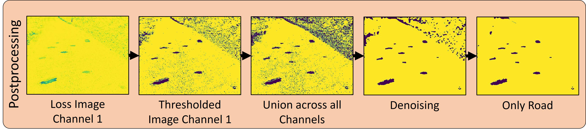

<h1 align="center">Detection of Unknown Substances in Operation Environments Using Multispectral Imagery and Autoencoders</h1>
<p align="center">
  <a href="https://img.shields.io/badge/Made%20with-Python-1f425f.svg">
    
  </a>
    
  </a>
    <a href="https://twitter.com/dlr_software">
    
  </a>
</p>

This is the code release for the paper *Detection of Unknown Substances in Operation Environments Using Multispectral Imagery and Autoencoders* accepted at PAIS 2025. 

Authors: [Peer Schütt](https://orcid.org/0000-0002-6513-5235)¹, [Jonas Grzesiak](https://orcid.org/0000-0001-9690-0780)², [Christoph Geiß](https://orcid.org/0000-0001-6518-0012)² and [Tobias Hecking](https://orcid.org/0000-0003-0833-7989)¹

¹ Institute of Software Technology, German Aerospace Center (DLR)          
² Institute of Technical Physics, German Aerospace Center (DLR)

<p align="center">

</p>


## Abstract
Autonomous vehicles and robotic systems are increasingly used to perform operations in environments that bear potential risks to humans (e.g. areas affected by natural disasters, warfare, or planetary exploration). One source of danger is the contamination with hazardous substances. 
In order to improve situational awareness and planning, such substances must be detected using the sensors of the autonomous system. 
However, training a supervised machine learning model to detect different substances requires a labelled dataset with all potential substances to be known in advance, which is often impracticable. 
A possible solution for this is to pose an anomaly detection problem where an unsupervised algorithm detects suspicious substances that differ from the normal operation environment.

In this paper we propose SpectrAE, a convolutional autoencoder-based system that processes multispectral imaging data (covering visible to near-infrared ranges) to identify surface anomalies on roads. Unlike traditional detection methods such as gas chromatography and physical sampling that risk contamination and cause operational delays, or laser-based remote sensing techniques that require pre-localisation of potential hot spots, our approach offers near real-time detection capabilities without prior knowledge of specific hazardous substances. The system is trained exclusively on normal road conditions and identifies potential hazards through localised reconstruction loss patterns, generating Areas of Interest for further investigation.
Our contributions include a robust end-to-end detection pipeline, comprehensive evaluation of system performance, and a roadmap for future development in this emerging intersection of autonomous systems and crisis response technologies.

## Installation

To get started with our pipeline, you'll need to create a suitable environment with the required dependencies. We recommend using Anaconda or Miniconda to manage your environment. Here's a step-by-step guide to installing the necessary packages:

```bash
conda create --name spectrae python=3.10 --channel conda-forge
conda activate spectrae
conda install pip # make sure pip is installed
pip install -r requirements.txt --no-cache-dir
```

This will set up your environment with the necessary dependencies. If you prefer to use a different package manager or environment setup, you can refer to the ``requirements.txt`` file for the list of required packages.

## Autoencoder Training

<p align="center">

</p>

The autoencoder is responsible for learning the patterns and features of normal road conditions. To train the autoencoder, we've provided a Python script called ``main.py``. This script allows you to customize the training process using command-line arguments.

To get started, navigate to the SpectrAE directory and run ``python main.py -h`` to view the available options. You can modify the training parameters, such as the number of epochs, batch size, and learning rate, to suit your specific needs.

To train the autoencoder with the default settings, simply run ``python main.py``. The script will train the model and subsequently test it on the validation set. The postprocessing steps involved in generating anomaly maps are described in the [Postprocessing - Generating Anomaly Maps](#postprocessing---generating-anomaly-maps) section.

For logging the model's training progress, we utilize Weights & Biases ([WandB](https://wandb.ai)). To use WandB, simply set the ``-wandb`` command-line flag and log in to your WandB account.


## Multispectral Image Dataset

We've included a sample of the multispectral dataset in the [sample_images](sample_images/) directory, which contains a selection of images in various formats.

The dataset consists of several file types, each serving a specific purpose:
- ``.npy`` files: These contain the raw multispectral image data.
- ``.png`` and ``.tiff`` files: These are visualizations of the multispectral data, intended for human interpretation.
- ``.json`` files: These contain the class labels and annotations for the images.

With the [convert_to_png.ipynb](samples_images/convert_to_png.ipynb) notebook you can create the `.png` files from the `.npy` files for visualization of the data. 

### Labels
We have used the [Labelme Tool](https://github.com/wkentaro/labelme) for image annotations. To visualize the annotated images, you can use the [jupyter_notebooks/visualization_labelled_images.ipynb](jupyter_notebooks/visualization_labelled_images.ipynb) notebook.

## Postprocessing - Generating Anomaly Maps

<p align="center">

</p>

The postprocessing step is responsible for generating anomaly maps from the autoencoder's output. The anomaly maps highlight regions of the input image that are likely to contain hazardous substances.

### Threshold Calculation

To generate accurate anomaly maps, we need to calculate a threshold for each channel of the autoencoder's output. This is done by analyzing the reconstruction losses of the validation set, which are used to determine the 95th or 99th percentile of the losses per channel. This is done in the [postprocessing_loss_threshold_calculation.ipynb](jupyter_notebooks/postprocessing_loss_threshold_calculation.ipynb) notebook. The thresholds are then saved in the `trained_models` folder.

### Anomaly Maps & Performance Metrics

Once the thresholds are calculated, you can use them to generate anomaly maps from the autoencoder's output. The [postprocessing_performance_table_all.ipynb](jupyter_notebooks/postprocessing_performance_table_all.ipynb) notebook demonstrates how to process the loss maps and generate binary anomaly maps. This notebook also calculates various performance metrics, such as precision, recall, and F1-score, to evaluate the system's performance.


## Citation

Provisional citation pending conference proceedings:

```bibtex
@INPROCEEDINGS{schuett2025detection,
  author={Sch{\"u}tt, Peer and Grzesiak, Jonas and Gei{\ss}, Christoph and Hecking, Tobias},
  title={Detection of Unknown Substances in Operation Environments Using Multispectral Imagery and Autoencoders},
  booktitle={2025 7th International Conference on Pattern Analysis and Intelligent Systems (PAIS)}, 
  year={2025},
  volume={},
  number={},
  pages={},
  doi={}}
```


## License
This project is licensed under the MIT License - see the [LICENSE](LICENSE) file for details.


